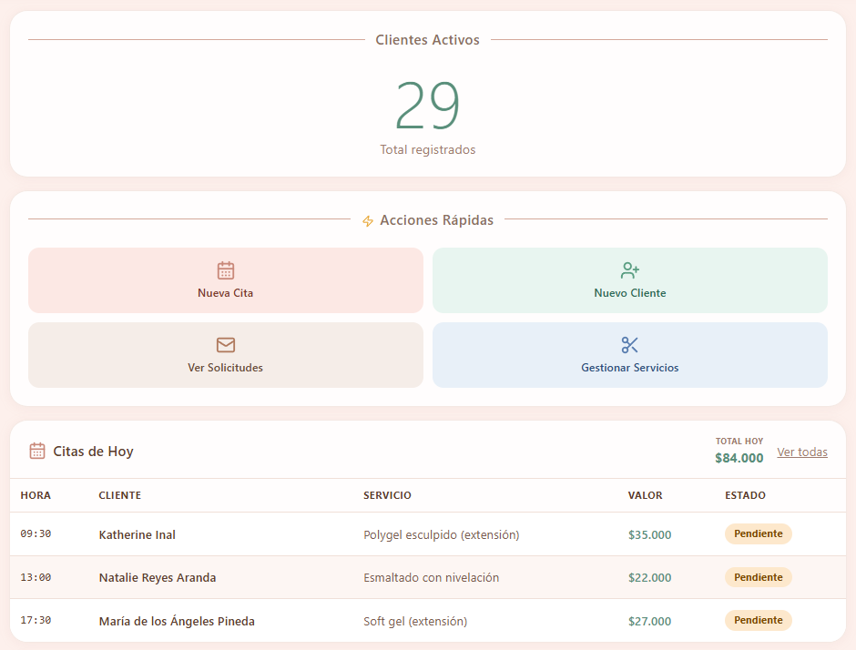
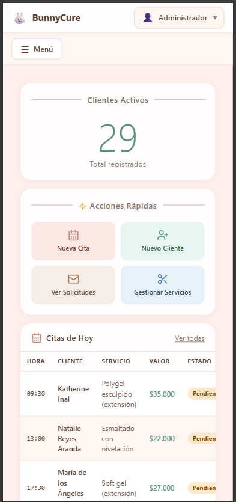
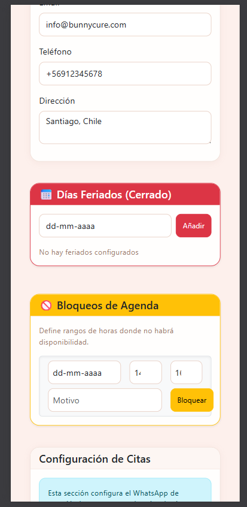

# 🐰 BunnyCure Frontend

  
   
  
  

BunnyCure Frontend es una aplicación PWA (Progressive Web App) construida con tecnologías web modernas. Sirve como la interfaz administrativa y de cliente para la gestión ágil de citas, clientes y servicios, comunicándose con un backend a través de una API REST protegida.

## 🚀 Stack Tecnológico

- **Core:** [React 19](https://react.dev/) con [TypeScript](https://www.typescriptlang.org/) y [Vite](https://vitejs.dev/)
- **Gestión de Estado:** [Zustand](https://zustand-demo.pmnd.rs/) (Store modular para Auth, Citas, Clientes, etc.)
- **Estilos y UI:** [Tailwind CSS](https://tailwindcss.com/) + Componentes de [Bootstrap 5](https://getbootstrap.com/)
- **Peticiones HTTP:** [Axios](https://axios-http.com/) (interceptores configurados para JWT y CSRF)
- **Formularios:** [React Hook Form](https://react-hook-form.com/) + [Yup](https://github.com/jquense/yup)
- **PWA:** `vite-plugin-pwa` (soporte offline, service workers e instalación nativa)
- **Iconografía:** [Lucide React](https://lucide.dev/) y [React Icons](https://react-icons.github.io/react-icons/)
- **Calendario y Gráficos:** `react-big-calendar` y `recharts`

## ⚙️ Arquitectura y Estándares

- **API Client:** La configuración central de Axios se encuentra en `src/api/client.ts`, con `withCredentials: true` para un manejo seguro de la sesión.
- **Manejo de Sesión:** El `authStore` gestiona el ciclo de vida del JWT y las redirecciones automáticas.
- **Diseño Mobile-First:** Uso intensivo de utilidades de Tailwind y estilos personalizados en `mobile.css` para garantizar fluidez en dispositivos móviles.
- **Cálculo de Precios:** La lógica centralizada (`getAppointmentTotal`) asegura que los cargos por "Extras personalizados" y otras adiciones se reflejen correctamente tanto en el frontend como en el backend.

## 🛠️ Desarrollo Local

En el directorio del proyecto, puedes ejecutar los siguientes comandos:

### `npm run dev`
Inicia el servidor de desarrollo ultrarrápido de Vite.

### `npm run build`
Compila la aplicación para producción. Primero verifica los tipos de TypeScript (`tsc -b`) y luego empaqueta los assets con Vite.

### `npm run lint`
Ejecuta ESLint para analizar el código en busca de posibles errores o desviaciones en el estilo de código.

### `npm run preview`
Inicia un servidor web local para visualizar la versión compilada (`dist`) de producción antes del despliegue.

## 📦 Estructura del Proyecto

El código fuente principal se encuentra en la carpeta `src/`:

- `api/`: Definiciones de endpoints, interfaces de API y configuración de Axios.
- `components/`: Componentes modulares y reutilizables de React.
- `hooks/`: Custom hooks (e.g., `useAuth`, `useToast`, `useMediaQuery`).
- `pages/`: Vistas de nivel superior asociadas a las rutas (Dashboard, Citas, Clientes).
- `routes/`: Configuración del enrutador de la aplicación (`AppRouter.tsx`).
- `stores/`: Manejo de estado global mediante Zustand.
- `styles/`: Hojas de estilo globales, temas y ajustes para móviles.
- `types/`: Definiciones estrictas de interfaces y tipos para TypeScript.
- `utils/`: Utilidades generales y configuración específica de la PWA.

## 📱 Progressive Web App (PWA)

El proyecto está configurado para ofrecer una experiencia nativa como PWA:
- Permite la instalación directa en dispositivos móviles y de escritorio.
- Implementa estrategias de caché de assets para un acceso rápido y soporte offline parcial.
- Muestra avisos (`PWAUpdatePrompt`) para actualizar automáticamente cuando se despliega una nueva versión.

## 📝 Notas Relevantes

- **Notificaciones Push en iOS:** El sufijo _"from BunnyCure"_ es un comportamiento nativo impuesto por el sistema de Apple por motivos de seguridad; no se debe alterar ni intentar remover.
- **Edición de Citas:** Al actualizar el costo total de un servicio, los extras seleccionados se formatean y se inyectan automáticamente en el campo de notas (`notes`) de la cita para su correcto registro y procesamiento en el lado del servidor.
