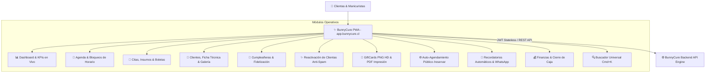

# 🐰 BunnyCure - Progressive Web App (PWA)

[](https://react.dev/)
[](https://www.typescriptlang.org/)
[](https://vitejs.dev/)
[](https://tailwindcss.com/)
[](https://getbootstrap.com/)
[](https://web.dev/progressive-web-apps/)

**BunnyCure Frontend** es una Progressive Web App (PWA) moderna, rápida y mobile-first diseñada para la gestión integral de salones de belleza y centros estéticos especializados en manicure y cuidado de uñas. 

Opera bajo una **arquitectura desacoplada (Headless)** como la única interfaz de usuario y administración (`https://app.bunnycure.cl`), comunicándose mediante JWT con la API REST de Spring Boot (`https://api.bunnycure.cl`).

---

## 🌟 Características y Módulos Principales


```mermaid
graph TD
    User[📱 Clientas & Manicuristas] --> PWA[✨ BunnyCure PWA - app.bunnycure.cl]
    
    subgraph Módulos Operativos
        PWA --> Dashboard[📊 Dashboard & KPIs en Vivo]
        PWA --> Calendar[📅 Agenda & Bloqueos de Horario]
        PWA --> Appointments[💅 Citas, Insumos & Boletas]
        PWA --> Customers[👥 Clientes, Ficha Técnica & Galería]
        PWA --> Birthdays[🎂 Cumpleañeras & Fidelización]
        PWA --> Reactivation[✨ Reactivación de Clientas Anti-Spam]
        PWA --> GiftCards[🎁 GiftCards PNG HD & PDF Impresión]
        PWA --> Booking[🌐 Auto-Agendamiento Público /reservar]
        PWA --> Reminders[🔔 Recordatorios Automáticos & WhatsApp]
        PWA --> CashClosing[💰 Finanzas & Cierre de Caja]
        PWA --> Spotlight[🔍 Buscador Universal Cmd+K]
    end

    PWA -->|JWT Stateless / REST API| Backend[⚙️ BunnyCure Backend API Engine]
```

---

### 1. 📅 Agenda & Calendario Interactivo (`/calendar`)
- **Vistas Dinámicas:** Visualización mensual y desglose diario de citas con estados (`CONFIRMED`, `PENDING`, `COMPLETED`, `CANCELLED`).
- **Bloqueos de Agenda:** Creación y persistencia en base de datos de bloqueos por tramo horario o días completos cerrados con motivo personalizado.
- **Franjas Horarias Visuales:** Configuración de bandas de color personalizadas para identificar horarios de atención.
- **Identificación de Clientes:** Visualización directa de identificación fiscal, nombre y datos de contacto en cada cita agendada.

---

### 2. 💅 Citas, Recetas de Insumos & Facturación (`/appointments`, `/services`)
- **Recetas de Insumos por Servicio:** Configuración de insumos requeridos por servicio con cálculo en tiempo real del costo de materiales y porcentaje de margen bruto de ganancia.
- **Completado de Citas con Descuento de Stock:** Modal interactivo que descuenta insumos de bodega, soporta stock en déficit y emite boletas de venta.
- **Valoración en Google Reviews:** Disparo automático en WhatsApp (`wa.me`) con mensaje personalizado e invitación a calificar el servicio al completar la atención.
- **Cálculo de Precios con Extras:** Función centralizada `getAppointmentTotal` que calcula el precio final respetando los cargos adicionales registrados en notas.

---

### 3. 👥 Ficha de Clientas, RUT Flexible & Galería Técnica (`/customers/:id`)
- **Tratamiento Flexible de Identificación Dual:** Acepta indistintamente el documento de identidad con formato con puntos, sin puntos o continuo tanto en búsquedas como en formularios.
- **Ficha Técnica Permanente de Manicure:** Registro de técnicas habituales (Kapping, Rubber, Polygel, Acrílico, etc.), estado de la uña (sensible, dañada, quebradiza), notas médicas/alergias y colores favoritos.
- **Galería Fotográfica con Compresión en Canvas:** Carga y optimización de fotos de trabajos desde cámara o galería móvil con visor modal en pantalla completa.
- **Tarjeta de Sellos Digital:** Acumulación automática de sellos de visita y sincronización con Google Wallet.

---

### 4. 🎂 Cumpleañeras del Mes & Fidelización (`/customers`)
- **Pestaña Dedicada de Cumpleañeras:** Tarjetas KPI en vivo (*Cumplen este mes, ¡Cumplen hoy!, Próximos 7 días, Saludadas este año*).
- **Filtros por Mes y Búsqueda en Vivo:** Navegación por mes (Enero a Diciembre) y buscador reactivo.
- **Envío en 1-Clic a WhatsApp:** Plantillas preconfiguradas de saludo con beneficios y promociones, junto con registro de trazabilidad anual para evitar duplicados.

---

### 5. ✨ Reactivación de Clientas Inactivas (`/customers`)
- **Segmentación por Días sin Agendar:** Clasificación automática de clientas inactivas según ventana temporal de inactividad (Mantención, Seguimiento, Críticas).
- **Exclusión Inteligente:** Excluye automáticamente clientas con citas futuras ya agendadas.
- **Control Anti-Spam:** Registro de fecha de último contacto con período de enfriamiento para proteger a las clientas de mensajes reiterativos.
- **Mensajería Personalizada:** Selección de tono de mensaje (Cariñoso, Promoción, Chequeo de Uñas) y apertura directa en WhatsApp oficial.

---

### 6. 🎁 Módulo de GiftCards Digitales y Físicas (`/giftcards`)
- **Emisión Segura:** Generación con código alfanumérico único y PIN de seguridad.
- **Exportación en Alta Definición:**
  - **Imagen HD (.PNG):** Renderizado en canvas listo para enviar por WhatsApp o redes sociales.
  - **Documento de Impresión (.PDF):** Formato oficial con membrete, instrucciones de canje y líneas de corte para regalo físico.
- **Portal Público de Consulta (`/giftcards/public/:code`):** Permite a la beneficiaria consultar saldo y estado ingresando su PIN.
- **Canje en Citas:** Aplicación como medio de pago en citas del salón.

---

### 7. 🌐 Portal Público de Auto-Agendamiento (`/reservar`)
- **Acceso Público sin Login:** Flujo mobile-first de 3 pasos para clientas:
  1. *Paso 1:* Selección de servicios del catálogo con precios y duraciones estimadas.
  2. *Paso 2:* Selector de fecha y bloque horario sugerido (*Mañana, Tarde, Noche*).
  3. *Paso 3:* Datos de contacto con validación flexible de formato, redes sociales y notas de diseño o retiro previo.
- **Switch Maestro ON/OFF:** Habilitación o pausa de la agenda online en 1-clic desde el panel administrativo. Si está pausado, muestra una pantalla amigable invitando a coordinar por WhatsApp.

---

### 8. 🔔 Panel de Recordatorios de Citas (`/reminders`)
- **Pestañas Temporales Rápidas:** `📅 Citas de Hoy`, `🌅 Citas de Mañana`, `⏳ Todas las Pendientes` y `🗓️ Todas`.
- **Doble Botón de Acción:** Disparo automatizado por backend (`remindersApi`) y contingencia manual de 1-clic con mensaje oficial precargado en WhatsApp (`wa.me`).

---

### 9. 💰 Finanzas & Cierre de Caja (`/analytics`)
- **Cierre Diario y Mensual en 1-Clic:** Resumen financiero con Ingresos Brutos, Costo de Insumos Deducidos, Utilidad Neta Estimada, Margen Bruto (%), Boletas Emitidas y Ticket Promedio.
- **Desglose por Medio de Pago:** Efectivo, Transferencia, Débito/POS, Crédito y GiftCard.
- **Exportación Contable:** Impresión directa en PDF con formato de informe y descarga en formato CSV/Excel.

---

### 10. 🔍 Buscador Universal Spotlight (`Cmd+K` / `Ctrl+K`)
- **Atajo Global:** Accesible desde cualquier pantalla mediante `Cmd+K` (Mac) o `Ctrl+K` (Windows/Linux) o botón en la barra de navegación.
- **Indexación en 4 Categorías:** Acciones Rápidas, Clientas, Citas y Servicios del Catálogo.

---

## 🛠️ Stack Tecnológico

| Capa | Tecnologías |
| :--- | :--- |
| **Framework & Lenguaje** | [React 19](https://react.dev/), [TypeScript 5.7](https://www.typescriptlang.org/), [Vite 6](https://vitejs.dev/) |
| **Estado Global** | [Zustand](https://zustand-demo.pmnd.rs/) (Stores modulares para Auth, Appointments, Customers, GiftCards, Loyalty) |
| **Estilos & UI** | [Tailwind CSS](https://tailwindcss.com/), [Bootstrap 5](https://getbootstrap.com/), `mobile.css` (Mobile-First) |
| **PWA & Offline** | `vite-plugin-pwa`, `workbox-window`, Service Worker con caché de 202 assets |
| **Formularios & Validación** | [React Hook Form](https://react-hook-form.com/), [Yup](https://github.com/jquense/yup) |
| **Peticiones HTTP** | [Axios](https://axios-http.com/) con interceptores para JWT stateless y CSRF |
| **Iconos & Gráficos** | [Lucide React](https://lucide.dev/), [React Icons](https://react-icons.github.io/react-icons/), [Recharts](https://recharts.org/) |
| **Fechas & Utilidades** | [date-fns](https://date-fns.org/), Canvas API para compresión de imágenes y renderizado de GiftCards |

---

## 📂 Estructura del Proyecto

```
bunnycure-frontend/
├── public/                 # Assets estáticos, iconos PWA y fondos de GiftCard
├── src/
│   ├── api/                # Clientes Axios por dominio (appointments, customers, bookings, etc.)
│   ├── components/         # Componentes React organizados por funcionalidad:
│   │   ├── appointments/   # Modales de completado de citas, recetas de insumos
│   │   ├── common/         # Layouts, Navbar, Spotlight Modal, BunnyRouteLoading
│   │   ├── customers/      # Fichas, cumpleañeras, reactivación, galería y ficha técnica
│   │   ├── giftcards/      # Visores, modales de canje y generadores
│   │   └── services/       # Formularios de catálogo y configuración de insumos
│   ├── hooks/              # Custom hooks (useAuth, useToast, useCalendarDisplayConfig)
│   ├── pages/              # Vistas principales protegidas y públicas (lazy loaded)
│   ├── routes/             # Enrutador AppRouter.tsx con ProtectedRoute y rutas públicas
│   ├── stores/             # Stores Zustand (authStore, appointmentsStore, customersStore, etc.)
│   ├── styles/             # Tailwind CSS, index.css, mobile.css
│   ├── types/              # Interfaces y tipos de TypeScript estrictos
│   └── utils/              # Formateadores CLP, utilidades de validación, giftcardRenderer, etc.
├── Dockerfile              # Construcción multi-stage (Node 22 + Nginx Alpine)
├── nginx.conf              # Configuración de producción Nginx para SPA, proxy y caché PWA
├── vercel.json             # Configuración de despliegue serverless
└── vite.config.ts          # Configuración Vite, chunks optimizados y VitePWA
```

---

## 🚀 Instalación y Desarrollo Local

### Prerrequisitos
- **Node.js:** Versión `>= 20.x` (Recomendado Node 22 LTS).
- **Gestor de Paquetes:** `npm` versión `>= 10.x`.

### 1. Clonar e Instalar Dependencias
```bash
git clone https://github.com/astuardo/bunnycure-frontend.git
cd bunnycure-frontend
npm install
```

### 2. Variables de Entorno
Crea un archivo `.env.local` en la raíz del proyecto con la URL de la API local:
```env
VITE_API_BASE_URL=http://localhost:8080
VITE_APP_NAME=BunnyCure
```

Para producción (`.env.production`):
```env
VITE_API_BASE_URL=https://api.bunnycure.cl
VITE_APP_NAME=BunnyCure
VITE_GA_MEASUREMENT_ID=G-XXXXXXXXXX
```

### 3. Comandos Disponibles

| Comando | Descripción |
| :--- | :--- |
| `npm run dev` | Inicia el servidor local de desarrollo en `http://localhost:5173`. |
| `npm run build` | Compila y valida tipos de TypeScript (`tsc -b`), generando el bundle de producción en `dist/`. |
| `npm run preview` | Inicia un servidor web local para probar el build de producción antes de desplegar. |
| `npm run lint` | Ejecuta ESLint para auditar el código fuente. |

---

## 🐳 Despliegue en Producción (Docker & Nginx)

El proyecto incluye un archivo `Dockerfile` multi-stage optimizado para producción:

```bash
# Construir la imagen Docker
docker build -t bunnycure-frontend:latest .

# Ejecutar el contenedor en el puerto 80
docker run -d -p 80:80 --name bunnycure-app bunnycure-frontend:latest
```

---

## 📜 Mandatos Críticos de Desarrollo

1. **Cálculo de Precios:** Siempre utilizar la función centralizada `getAppointmentTotal(appointment)` para garantizar que los "Extras personalizados" registrados en las notas se reflejen en los totales de caja y dashboard.
2. **Tratamiento de Identificación:** Usar siempre las utilidades de `src/utils/rutUtils.ts` (`normalizeRut`, `isValidRutFormat`, `matchRutSearch`) para permitir que las usuarias ingresen su documento de identidad con formato flexible (con o sin puntos/guión) de forma indistinta.
3. **Canal de Contacto Oficial:** La mensajería automática y enlaces directos utilizan el número de atención configurado dinámicamente en el sistema.

---

## 📄 Licencia

Desarrollado para el ecosistema **BunnyCure**. Todos los derechos reservados.
