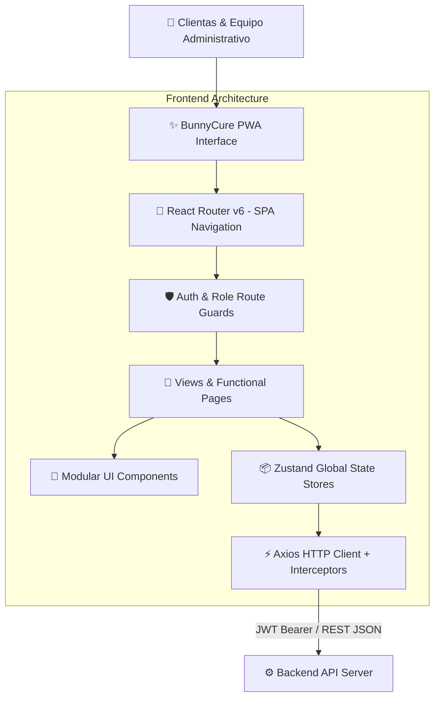

# 🐰 BunnyCure - Progressive Web App (PWA)

[](https://react.dev/)
[](https://www.typescriptlang.org/)
[](https://vitejs.dev/)
[](https://getbootstrap.com/)
[](https://github.com/pmndrs/zustand)
[](https://web.dev/progressive-web-apps/)

**BunnyCure Frontend** es una Progressive Web App (PWA) moderna, reactiva y *mobile-first* diseñada para la administración operativa, agendamiento de citas, fidelización de clientas y control financiero de centros estéticos y estudios de manicura.

Opera como una Single Page Application (SPA) desacoplada que se comunica de forma asíncrona mediante REST API y autenticación segura por tokens.

---

## 🏗️ Arquitectura de la Aplicación


```mermaid
graph TD
    User[📱 Clientas & Equipo Administrativo] --> PWA[✨ BunnyCure PWA Interface]
    
    subgraph Frontend Architecture
        PWA --> Router[🧭 React Router v6 - SPA Navigation]
        
        Router --> Guards[🛡️ Auth & Role Route Guards]
        Guards --> Pages[📄 Views & Functional Pages]
        
        Pages --> Components[🧩 Modular UI Components]
        Pages --> Stores[📦 Zustand Global State Stores]
        
        Stores --> ApiClient[⚡ Axios HTTP Client + Interceptors]
    end

    ApiClient -->|JWT Bearer / REST JSON| BackendApi[⚙️ Backend API Server]
```

---

## 🛠️ Stack Tecnológico

| Capa / Módulo | Tecnología | Propósito |
|---|---|---|
| **Core Framework** | React 19 | Biblioteca principal para construcción de interfaces de usuario |
| **Lenguaje** | TypeScript 5.7 | Tipado estático estricto para robustez y mantenibilidad |
| **Bundler & Dev Server** | Vite 6 | Empaquetado ultrarrápido con Hot Module Replacement (HMR) |
| **Gestión de Estado** | Zustand | Gestión de estado global ligera, predecible y reactiva |
| **Enrutamiento** | React Router DOM 6 | Enrutamiento declarativo del lado del cliente con guards |
| **Diseño & UI** | React-Bootstrap / Bootstrap 5 | Sistema de grillas responsivo y componentes accesibles |
| **Iconografía** | Lucide React | Conjunto de iconos vectoriales modernos y consistentes |
| **Cliente HTTP** | Axios | Peticiones asíncronas con interceptores automáticos de autenticación |
| **Gráficos & Métricas** | Chart.js & React-Chartjs-2 | Visualización interactiva de ingresos, tendencias y servicios |
| **Manejo de Fechas** | Date-fns | Manipulación, formateo e internacionalización de fechas |
| **Motor de Documentos** | HTML5 Canvas & jsPDF | Generación de tarjetas de regalo de alta fidelidad y exportación PDF |
| **Tecnología PWA** | Vite PWA Plugin & Workbox | Instalación nativa en dispositivos móviles, caché y manifiesto web |

---

## 📁 Estructura del Proyecto

```text
bunnycure-frontend/
├── public/                  # Recursos estáticos públicos, logos, favicons e iconos PWA
├── src/
│   ├── api/                 # Módulos de comunicación HTTP con la API (Axios clients)
│   ├── components/          # Componentes reutilizables de UI
│   │   ├── common/          # Layouts, Navbar, Sidebar, Modales comunes y Guards
│   │   ├── appointments/    # Componentes para gestión y completado de citas
│   │   ├── customers/       # Fichas técnicas, pestañas de reactivación y cumpleaños
│   │   ├── giftcards/       # Renderizadores de tarjetas y exportadores
│   │   └── services/        # Modales de recetas de insumos y costos
│   ├── hooks/               # Custom React Hooks (autenticación, responsividad, toasts)
│   ├── pages/               # Vistas principales de la aplicación
│   │   ├── analytics/       # Reportes analíticos y gráficos financieros
│   │   ├── appointments/    # Listado, filtrado y edición de citas
│   │   ├── auth/            # Login, recuperación y reseteo de credenciales
│   │   ├── booking/         # Portal público de auto-agendamiento para clientas
│   │   ├── calendar/        # Agenda visual interactiva y bloqueos de horario
│   │   ├── customers/       # Directorio de clientes y detalle individual
│   │   ├── dashboard/       # Tablero principal con métricas en tiempo real e insights
│   │   ├── giftcards/       # Emisión, consulta y validación de tarjetas de regalo
│   │   ├── reminders/       # Centro de control de recordatorios y avisos
│   │   ├── services/        # Catálogo de servicios y cálculo de insumos
│   │   ├── settings/        # Configuraciones generales y ciclo de fidelización
│   │   └── users/           # Administración de usuarios y personal
│   ├── router/              # Definición de rutas protegidas y públicas
│   ├── stores/              # Stores de Zustand (Auth, Appointments, Customers, etc.)
│   ├── types/               # Definiciones de tipos e interfaces TypeScript
│   ├── utils/               # Utilidades de negocio, validación de RUT, cálculos y formato
│   ├── App.tsx              # Componente raíz de la aplicación
│   ├── index.css            # Estilos globales y tokens de diseño
│   └── main.tsx             # Punto de entrada de la aplicación React
├── package.json             # Dependencias y scripts de desarrollo
├── tsconfig.json            # Configuración de compilación TypeScript
├── vite.config.ts           # Configuración de Vite y plugin PWA
└── README.md
```

---

## 🧩 Módulos Funcionales

1. **Dashboard & Métricas en Vivo (`/dashboard`):**
   - Resumen semanal alineado con el calendario operativo.
   - Comparativa de ingresos cobrados reales versus proyectados activos.
   - Identificación de clientas frecuentes y ranking de servicios más solicitados.

2. **Agenda & Calendario Operativo (`/calendar`):**
   - Vista de calendario interactivo con diferenciación por estados de cita.
   - Bloqueo por franjas horarias o días completos por eventos o descansos.
   - Visualización directa de contacto y detalle del servicio.

3. **Directorio de Clientes & Fidelización (`/customers`, `/settings/loyalty`):**
   - Búsqueda flexible por nombre, RUT o teléfono.
   - Indicadores de fidelidad: tarjetas de sellos acumulados (`⭐ X/10`) y total de visitas.
   - Detección de cumpleaños del mes para promociones exclusivas.
   - Ranking clasificado con podio de clientas más fieles y contacto directo vía mensajería.
   - Ficha técnica de manicure con notas de salud y registro fotográfico de atenciones.

4. **Reactivación Inteligente de Clientas:**
   - Segmentación automática por días transcurridos desde su última atención.
   - Exclusión de clientas con citas futuras agendadas.
   - Período de enfriamiento para prevenir mensajes redundantes.

5. **Catálogo de Servicios & Costeo de Insumos (`/services`):**
   - Creación de servicios con recetas de insumos asociados.
   - Cálculo automático del costo de materiales y porcentaje de margen bruto.
   - Descuento de inventario en bodega al completar atenciones.

6. **Motor de GiftCards Digitales & Físicas (`/giftcards`):**
   - Generación de tarjetas con código único y PIN de validación.
   - Exportación directa en imagen de alta definición (PNG) y formato imprimible (PDF).
   - Consulta pública de saldos y aplicación como medio de pago.

7. **Portal Público de Auto-Agendamiento (`/reservar`):**
   - Flujo responsive en 3 pasos para clientas finales.
   - Selector de catálogo, fecha sugerida y franja horaria disponible.
   - Control maestro para activar o pausar la recepción de reservas online.

---

## 🚀 Guía de Inicio Local

### Requisitos Previos
- **Node.js:** Versión 18.0 o superior (se recomienda Node 20 LTS).
- **npm:** 9.0+ o gestor compatible (`pnpm`, `yarn`).

### 1. Clonar el Repositorio
```bash
git clone <URL_DEL_REPOSITORIO>/bunnycure-frontend.git
cd bunnycure-frontend
```

### 2. Instalar Dependencias
```bash
npm install
```

### 3. Configurar Variables de Entorno
Crea un archivo `.env` en la raíz del proyecto basándote en el siguiente ejemplo:

```env
# URL base de la API REST local
VITE_API_BASE_URL=http://localhost:8080/api

# Identificador de entorno
VITE_APP_ENV=development
```

### 4. Iniciar Servidor de Desarrollo
```bash
npm run dev
```

La aplicación se ejecutará localmente en `http://localhost:5173`.

---

## 📦 Construcción y Despliegue

```bash
# Validar tipos TypeScript y compilar bundle de producción
npm run build

# Previsualizar el build de producción localmente
npm run preview
```

Los artefactos optimizados para producción se generarán en el directorio `dist/`, listos para ser servidos por cualquier servidor web estático o CDN.

---

## 🛡️ Seguridad y Buenas Prácticas

- **Tipado Estricto:** Toda la comunicación de red y estados globales cuentan con tipos e interfaces TypeScript exhaustivas.
- **Manejo Seguro de Sesiones:** Los tokens de autenticación se gestionan con expiración controlada y saneamiento en cierre de sesión.
- **Sanitización de Datos:** Validación y formateo de inputs (identificadores fiscales, teléfonos, montos).

---

## 📄 Licencia

Este proyecto es de uso privado y confidencial. Todos los derechos reservados.
